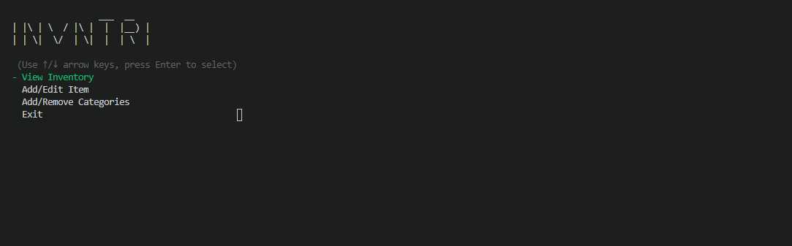

## Sections
- [Purpose Statement](#purpose-statement)
- [Features](#features)
- [User Stories](#user-stories)
- [User Interaction](#user-interaction)
- [Program Flow](#program-flow)
- [Implementation Plan](#implementation-plan)
- [Development Log](#development-log)
- [Testing](#Testing)
- [Installation & Help](./docs/helpfile.md)

## Purpose

INVNTRI is a command line application written in Ruby which allows users to record inventory items and store them in custom defined categories and sub-categories. Users can define their own item categories along with category-level attributes which they'd like to record. Users can also define item sub-categories and sub-category level attributes. This allows users to record inventory item data specific to the item's category and use.

Maintaining an inventory of items can be a difficult task. Without a system to manage and visualise your inventory, time will often be wasted counting items, checking if items are in stock, and checking the cost of items. INVNTRI aims to alleviate some of the difficulties of inventory management, saving the user time and stress.

INVNTRI was developed with small businesses in mind, but can be used by anyone who would like to maintain an inventory of items and record specific details about dissimilar items in a flexible, dynamic way.

INVNTRI includes several features:
* Create custom categories and sub-categories
* Record unique item data specific to each category and sub-category
* Add, edit and remove inventory items
* Search for inventory items by name or SKU
* View inventory by sub-category, category or entire inventory

## Features

### Add Inventory Item
  - Asks relevant questions to user about the item, creates a hash containing item information, pushes hash into main array containing all inventory items

### Edit Inventory Item
  * Takes a name or SKU as search input from the user, returns all inventory items whose name or SKU fields contain the search term, allows user to select which item they'd like to edit, then allows them to edit any of the details contained in that item's hash

### Remove Inventory Item
  * Takes a name or SKU as search input from the user, returns all inventory items whose name or SKU fields contain the search term, allows user to select which item they'd like to remove, and removes it with confirmation from the user.

### View Inventory
  * Entire Inventory
    * Returns a neatly formatted list of all inventory items
  * By Category:
    * Returns a list of all inventory items contained within the chosen category
  * By Sub_Category
    * Returns a list of all inventory items contained within the chosen sub-category

### Search Inventory
  * Takes a name or SKU as search input from the user, returns all inventory items whose name or SKU fields contain the search term

### Add Category/Sub-Category
  * Add Category
    * User inputs name of new category, and it is created
  * Add Sub-Category
    * User inputs name of new sub-category, and they can either assign it to an existing category, or make a new one. These are then created

## User Stories

* As a user, I want to add a new item to my inventory
* As a user, I want to edit an existing item in my inventory
* As a user, I want to remove an item from my inventory
* As a user, I want to see all of the items I have that belong to a certain category/sub category
* As a user, I want to be able to search my inventory for a specific item and see all of its details
* As a user, I want to be able to add new categories to my inventory and specify what kind of information belongs to items in that category (e.g. colour, size, etc)
* As a user, I want to be able to add new sub-categories to my inventory and specify which category it belongs under, and what kind of information belongs to items in that sub-category

## User Interaction, Usability & Error Handling

INVNTRI uses tty-prompt for all user input, menus and navigation. tty-prompt provides very user-friendly input options, allowing the user to use arrow keys to navigate a menu, and the enter key to select the chosen option. In a case where a user may need to select multiple options from a list of items, the user navigates using the arrow keys, makes their selections using the spacebar, and submits their final choices using the enter key.

Being a command-line app, the user will interact with the app entirely through the use of their keyboard. INVNTRI aims to minimise the use of keyboard input from the user in order to improve UX, and to reduce error-handling due to less unexpected inputs.

INVNTRI makes use of conditional validation for user input to assist with error-handling, as well as rescue blocks to catch known errors and guide the user to make valid input.

## Program Flow

## Implementation Plan

* Create Variables
  * Create main_nav array
  * Create inventory array and populate it with 3 dummy item hashes
  * Create category array and populate with 2 category hashes, each with 2 sub-categories
  * Estimated time for completion: 15 min
* Main Program Loop
  * Create an 'until' loop that is broken if 'exit' = true
  * Estimated time for completion: 2 min
* Main Menu Navigation
  * Install and require tty-prompt
  * Create main_nav array containing all navigation option
  * Create a new prompt using tty-prompt and the main_nav array as input
  * Create a case/when statement containing outcomes for each option
  * Create placeholder messages for each feature saying 'This feature is coming soon!'
  * Estimated time for completion: 25 min
* Feature - Add Inventory Item
  * Create two arrays inside the method called 'key_array' and 'value_array'
  * It is assumed that every single item in the inventory will have the following 'item-level' attributes: 'name', 'sku', 'cat', 'sub_cat', 'qty', 'cost' - pre-populate key_array with the inventory-level attributes
  * Prompt the user to input values for all item-level attributes and push these values to value_array
  * Take the user input for 'cat', and return an array of category-level attributes (found in the category hash)
  * Iterate over each element of said array, prompting user to input a value - push the category-level-attribute to key_array, and the user inputs to value_array
  * Take the user input for 'sub_cat', and return an array of sub-category-level attributes (found in the category hash)
  * Iterate over each element of said array, prompting user to input a value - push the sub-category-level-attribute to key_array, and the user inputs to value_array
  * Use the .zip method to merge both arrays into a hash, using key_array as keys, and value_array as values
  * Estimated time for completion: 1.5 hrs

* Feature - Edit Inventory Item
  * Use the search_inventory feature to return user's search results
  * User selects item to edit from search results
  * User selects which attributes they'd like to edit
  * User edits attributes
  * Save updates after user confirmation
  * Estimated time for completion: 1.5 hrs
* Feature - Remove Inventory Item
  * Use the search_inventory feature to return user's search results
  * User selects item to remove from search results
  * Delete item after user confirmation
  * Estimated time for completion: 1 hr
* Feature - View Inventory
  * Entire Inventory
    * Show user list of all items currently in inventory
    * Estimated time for completion: 45 mins
  * By Category:
    * User chooses category to view
    * Display all items in chosen category to user
    * Estimated time for completion: 1 hr
  * By Sub_Category
    * User chooses sub-category to view
    * Display all items in chosen sub-category to user
    * Estimated time for completion: 1.5 hrs

* Feature - Add Category/Sub-Category
    * Add Category
        * User inputs category name
        * User inputs category level attributes
        * Creates category hash containing name and attributes
        * Pushes hash to array of categories
    * Add Sub-Category
        * User chooses category to add sub-category to
        * User inputs sub-category name
        * User inputs sub-category level attributes
        * Creates category hash containing name and attributes
        * Pushes hash to array of sub-categories
    * Remove Category
        * User chooses category to remove from list
        * User confirms removal
        * Deletes category hash from categories array
    * Remove Sub-Category
        * User chooses category which contains sub-category
        * User chooses sub-category from list
        * User confirms removal
        * Deletes sub-category hash from categories array
    * Estimated time for completion: 3-5hrs

## Development Log

### 21-04-2020 -  day 1 - add_item feature additions & changes
While coding the add_item feature, I came up with an addition/change to the feature. Rather than having the user type in the category and sub-category of their new item, I would prefer to present the user with a list of options. This is easily done using tty-prompt, but first I needed to have the list of options as an array to pass to tty-prompt. I ended up retrieving these lists from the 'categories' hashes, which means that the user doesn't have to remember their category names, or manually type their category names and risk mistyping them (resulting in their item not being categorised properly). My implementation of this feature means that the add_item feature does not need to be updated if/when the categories array is changed, meaning once I have the add_category function working, the user will be able to add new categories and immediately start adding items to their new categories.

Trello at end of day 1

### 22-04-2020 11:15am - day 2 - missing user stories

While coding the edit_item feature this morning I realised I'd missed a few user stories that I needed in order to make my app useful. Most notably, that a user should be able to log whenever they use items from the inventory, and conversely, when they've added new items to the inventory. Say I've just taken an order for a drum, I should be able to tell my inventory system that I'm going to use 8 lugs, 16 tension rods, a snare strainer, some drum hoops, etc. Alternatively, if I've just received a shipment of stock, I need to be able to tell my system which items I've received, how many, and how much they cost me.

Trello board showing 2nd morning progress, new user stories, and new issues/suggestions

### 22-04-2020 3:30pm - day 2 - view inventory functions & yaml
While coding the functions according to my implementation plan, I decided that it would be nice to have an option to view the entire inventory as well as viewing it by category and by sub-category. I think that if I create a method to display sub-categories in a neat manner, I should be able to reuse it in the display_category and display_inventory methods.

I also felt that it would be necessary for the app to store the inventory and category hashes in an external database. After a little bit of research, I've decided to implement this using YAML as it works nicely with Ruby and is easy to read and interpret

Trello 2nd day, afternoon. Nearly completed all MVP features. Taking care of some minor improvements before moving on to more main features.

Trello end of 2nd day. More and more issues and ideas are coming to light as I code

Trello beginning day 3

## Testing

I wrote three tests which each test 3 of the app's main functions

### Add Category

### Add Sub-Category

### Inventory View

### Test Results

